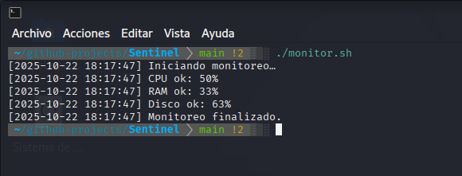

# 🛡️ Sentinel — Monitoring & Alert System for Linux  
### (Sistema de Monitoreo y Alertas para Linux)

---

## 🧩 Overview / Descripción  

**EN:**  
Sentinel is a lightweight Bash tool designed to monitor the health of a Linux system, detect anomalies, and generate automatic alerts to prevent critical issues.  
It’s ideal for system administrators, cybersecurity learners, and Linux enthusiasts who want to improve visibility and response in their environments.  

**ES:**  
Sentinel es una herramienta liviana en Bash diseñada para monitorear la salud de un sistema Linux, detectar anomalías y generar alertas automáticas para prevenir fallos críticos.  
Ideal para administradores de sistemas, estudiantes de ciberseguridad y entusiastas de Linux que buscan mejorar la visibilidad y respuesta en sus entornos.

---

## 📋 Features / Funciones  

| Feature (EN) | Descripción (ES) |
| ------------- | ---------------- |
| Monitor CPU, RAM, and Disk usage | Monitoreo de uso de CPU, RAM y Disco |
| Detect failed login attempts | Detección de intentos fallidos de inicio de sesión |
| Generate alerts via console, log file, and email | Generación de alertas por consola, archivo de logs y correo electrónico |
| Configurable thresholds through `config.conf` | Umbrales configurables mediante `config.conf` |

---

## ⚙️ Execution / Ejecución  

**EN:**  
Clone the repository and execute the monitor script:  

git clone https://github.com/Matiaslb14/05-Sentinel.git
cd 05-Sentinel
bash monitor.sh

ES:
Clona el repositorio y ejecuta el script de monitoreo:

git clone https://github.com/Matiaslb14/05-Sentinel.git
cd 05-Sentinel
bash monitor.sh

📁 Project Structure / Estructura del Proyecto

monitor.sh        # Main script / Script principal  
config.conf       # Thresholds and alert configuration / Umbrales y configuración de alertas  
logs/sentinel.log # Log file with detected events / Archivo de registro con eventos detectados  

🧠 Commands Used / Comandos Utilizados

| Command             | Description (EN)                      | Descripción (ES)                               |
| ------------------- | ------------------------------------- | ---------------------------------------------- |
| `top`, `free`, `df` | Collect CPU, RAM, and disk usage data | Recolectar datos de uso de CPU, RAM y disco    |
| `grep`, `lastb`     | Detect failed login attempts          | Detectar intentos fallidos de inicio de sesión |
| `mail`, `logger`    | Send and log alerts                   | Enviar y registrar alertas                     |
| `date`, `echo`      | Handle timestamps and output messages | Manejar marcas de tiempo y mensajes de salida  |

🖼️ Screenshot / Captura de Ejecución

EN:
Below is an example of Sentinel running on a Linux system, generating alerts based on configured thresholds.

ES:
A continuación se muestra un ejemplo de Sentinel ejecutándose en un sistema Linux, generando alertas según los umbrales configurados.

📘 Notes / Notas

EN:
This project is part of my Linux Automation & Security Toolkit series, focused on practical Bash scripting for system monitoring and security automation.

ES:
Este proyecto forma parte de mi serie Linux Automation & Security Toolkit, enfocada en scripting práctico en Bash para monitoreo y automatización de seguridad en sistemas Linux.

